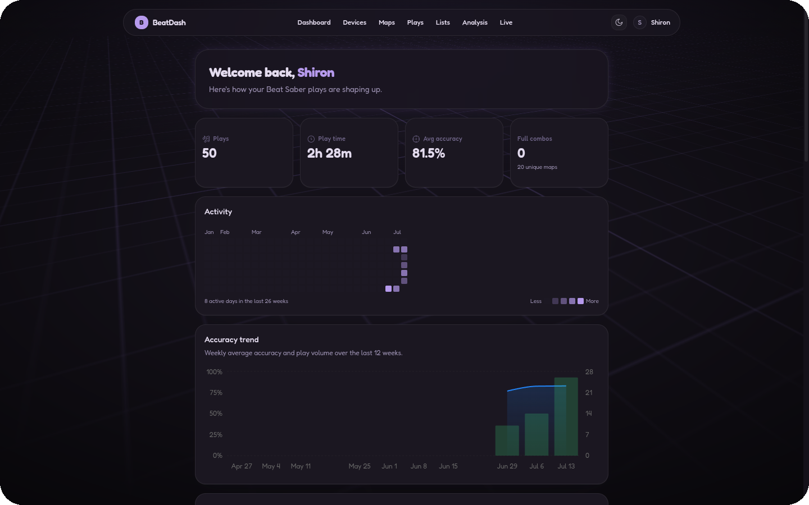
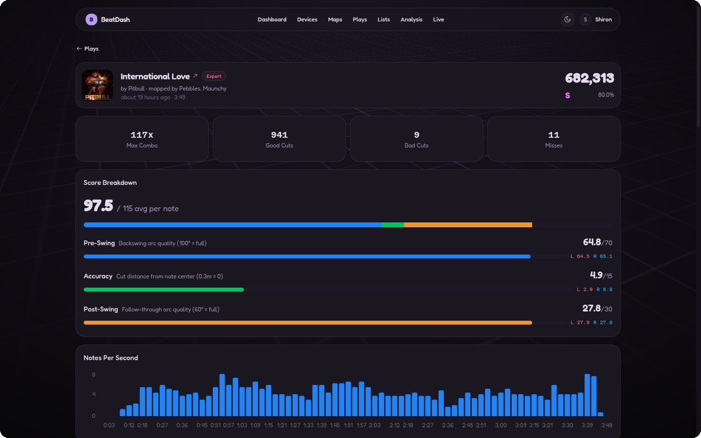
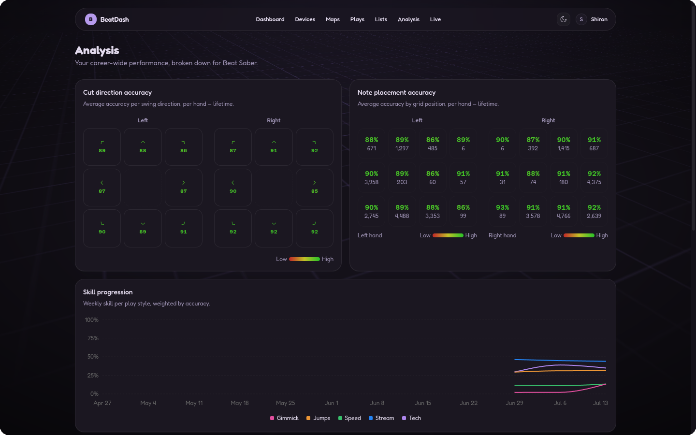
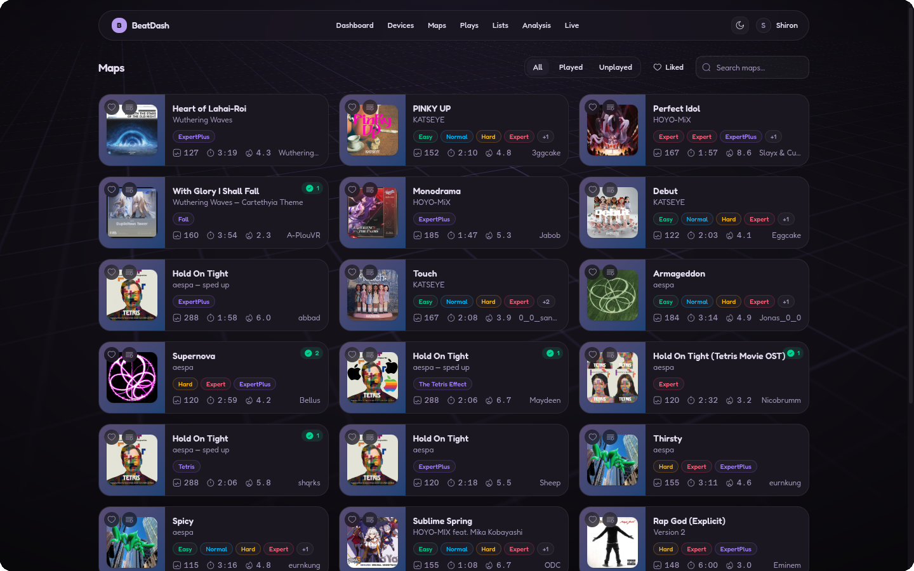

# BeatDash

Beat Saber profile and analytics dashboard. A Beat Saber mod streams gameplay data to a web dashboard (React) backed by an ASP.NET Core API and PostgreSQL.

<p align="center">
  
</p>

> **⚠️ Heavy Development Notice**
>
> BeatDash is in early development. Features are incomplete, the UI is rough, things will break, and the auth flow is not production-hardened. Expect breaking changes at any time. Do not rely on this for anything yet.

---

## Features

BeatDash pairs your VR headset with a web dashboard. When you start a song in-game, the mod streams the map and your gameplay to the dashboard, where it's stored and turned into per-play and career-wide stats.

The dashboard (shown above) opens on an overview of your account: total plays, play time, average accuracy, an activity heatmap, an accuracy trend, a skill radar, and your recent and best plays.

<table>
  <tr>
    <td width="50%"></td>
    <td width="50%">
      <h3>Per-play breakdown</h3>
      <p>Every play is scored note by note: the score split into pre-swing, accuracy, and post-swing components, good/bad cuts and misses, a notes-per-second graph, a combo and miss timeline, per-hand performance, saber motion, and a note-position grid.</p>
    </td>
  </tr>
  <tr>
    <td width="50%">
      <h3>Career analysis</h3>
      <p>Every play aggregated into lifetime views: accuracy per swing direction for each hand, accuracy by note grid position for each hand, and skill progression per play style (stream, tech, speed, jumps, gimmick) over time.</p>
    </td>
    <td width="50%"></td>
  </tr>
  <tr>
    <td width="50%"></td>
    <td width="50%">
      <h3>Beatmap catalog</h3>
      <p>Browse the maps you've played. Filter by played, unplayed, or liked, search by name, and see difficulties, note counts, length, star rating, and cover art for each.</p>
    </td>
  </tr>
</table>

### Also included

-   **Live tracking** — maps and score appear on the dashboard in real time as you play
-   **Device pairing** — link one or more Beat Saber installs to your account with a PIN
-   **Lists** — group maps into named collections
-   **Public profile** — a shareable page with the sections you choose to make visible

---

## Pairing & Setup

The mod pairs with your account once, then stays connected:

```
1. Register an account on the web dashboard (email + password)
2. Log in
3. Request a 6-digit PIN from the dashboard
4. Enter the PIN in the Beat Saber mod settings
5. The mod exchanges the PIN for tokens and stays connected
```

The mod authenticates over a WebSocket connection to the API. Access tokens expire every 15 minutes and refresh automatically — you only need to pair once per device.

The backend runs in Docker. With Docker installed:

1.  Download the latest BeatDash mod release and place it in your Beat Saber `Plugins` folder
2.  Start the backend and dashboard:
    ```sh
    docker compose up -d
    ```
3.  Open the dashboard in your browser, register, and follow the pairing flow above

---

## For Developers

### Structure

```
apps/
  beatdash-web/          # Web client (React + Vite + TanStack Router/Query)
packages/
  ui/                    # @shiron/ui - shared component library (Tailwind, shadcn) [submodule]
src/
  BeatDash.API/          # ASP.NET Core API (Minimal APIs, EF Core, SignalR, WebSocket/UDP)
  BeatDash.Data/         # Data layer - DTOs, socket + realtime message contracts
  BeatDash.DB/           # EF Core DbContext, schema, and migrations
  BeatDash.Analysis/     # Difficulty and performance metric extraction
  BeatDash.Beatmaps/     # Beatmap parsing
  BeatDash.Cli/          # CLI tool (beatmap calibration, maintenance)
  BeatDash.Mod/          # Beat Saber mod (BSIPA plugin, Zenject, Harmony) - net472
external/
  lib/                   # Shared .NET library [submodule]
docker/                  # Docker Compose configs for local infrastructure
```

### Tech Stack

**Frontend:** React 19, Vite, TypeScript, TanStack Router/Query, Tailwind CSS v4, shadcn/ui, Orval, Biome

**Backend:** .NET 10, ASP.NET Core Minimal APIs, EF Core, PostgreSQL (Npgsql), MinIO, SignalR, JWT Bearer auth

**Mod:** BSIPA plugin framework, Zenject DI, Harmony patching, WebSocket client

### Architecture

-   **Beat Saber mod → API:** TCP WebSocket (`/api/client/game`) for reliable/persisted data, plus UDP datagrams for frequent live updates (falls back to TCP)
-   **Web client → API:** REST (Orval-generated client) + SignalR (`/api/client/web`) for real-time updates
-   **Auth:** ASP.NET Core Identity + JWT. Access tokens (15 min) + refresh tokens (30 days), per-device
-   **Storage:** PostgreSQL for relational data, MinIO for cover images

### Protocol

The mod uses two transports to the API, picking one per packet based on reliability needs. The web dashboard only consumes REST + SignalR.

```
 Beat Saber Mod                   ASP.NET Core API                  Web Dashboard
┌───────────────┐  TCP WebSocket  ┌──────────────┐   REST (HTTPS)  ┌──────────────┐
│               │◄───────────────►│              │◄───────────────►│              │
│  reliable +   │  /api/client/   │              │  Orval client   │              │
│  persisted    │  game           │              │                 │              │
│               │  UDP datagrams  │              │  SignalR push   │              │
│  frequent +   │────────────────►│              │────────────────►│              │
│  transient    │                 │              │ /api/client/web │              │
└───────────────┘                 └──────────────┘                 └──────────────┘
```

#### Mod → API

| Transport | Use | Persisted? |
|---|---|---|
| **TCP (WebSocket)** | Infrequent updates that must arrive reliably and be stored — map-start metadata, cover art, gameplay state changes | Yes |
| **UDP (datagrams)** | Frequent live updates that are transient — score snapshots, motion frames | No |

> UDP is best-effort: packets may be dropped or arrive out of order. It is **never** used for data that needs to be persisted — anything stored goes over the TCP channel. Both transports feed into the same dispatcher, so handlers are transport-agnostic.

**Fallback.** If UDP is disabled, blocked, or the NAT holepunch fails, the mod automatically falls back to TCP for all traffic. On connect the mod attempts a UDP handshake; if the server doesn't acknowledge it within a few attempts, the mod stays on TCP.

**UDP bind flow:**

```
1. Mod opens the TCP WebSocket
2. Server issues a one-time ticket over TCP (UdpHandshakeMessage: ticket + UDP port)
3. Mod sends a Holepunch packet containing the ticket to the UDP port
4. Server validates the ticket and binds the endpoint to the session
5. Server acks over TCP (UdpBoundMessage) — UDP is now live
6. Mod prefers UDP for live data, falling back to TCP on any send failure
```

**Binary packets.** Both transports carry typed binary packets (`type byte + payload`). TCP frames include a length prefix; UDP datagrams are bare since each datagram is self-delimiting.

| Packet | Channel | Description |
|---|---|---|
| `MapStart` | TCP | Beatmap metadata when a song starts |
| `MapCoverImage` | TCP | Cover art (stored in MinIO) |
| `MapState` | TCP | Gameplay state change (pause/resume/finish/fail/quit) |
| `ScoreUpdate` | UDP → TCP | Live score snapshot on each scoring event |
| `MotionFrameBatch` | UDP → TCP | Batched saber/head motion frames |
| `Holepunch` | UDP only | Endpoint binding handshake |

JSON control messages (handshake, bound ack, correlation assignment, pings) travel over the TCP WebSocket as text frames.

#### API → Web

| Transport | Use |
|---|---|
| **REST** (Orval-generated client) | CRUD and reads — auth, devices, beatmap catalog, cover images |
| **SignalR** (`/api/client/web`) | Real-time push — live score updates, map started/changed, device online/offline |

Connections are grouped per user, so all of a user's open browser tabs receive the same live events. The API forwards live data straight from the socket handlers to the hub — it does not round-trip through the database.

### Prerequisites

-   [.NET 10 SDK](https://dotnet.microsoft.com/)
-   [Node.js](https://nodejs.org/) + [pnpm](https://pnpm.io/)
-   [Docker](https://www.docker.com/)

### Getting Started

1.  Clone with submodules:

    ```sh
    git clone --recurse-submodules https://github.com/iamshiron/BeatDash.git
    ```

2.  Install dependencies and set up env:

    ```sh
    pnpm install
    cp .env.example .env
    ```

3.  Start infrastructure (PostgreSQL, MinIO, Adminer):

    ```sh
    docker compose up -d
    ```

4.  Run everything in dev mode:

    ```sh
    pnpm dev
    ```

### Common Commands

| Command                      | Description                                        |
| ---------------------------- | -------------------------------------------------- |
| `pnpm dev`                   | Start the web app and API in dev mode              |
| `pnpm build`                 | Build all projects                                 |
| `pnpm lint`                  | Lint all projects                                  |
| `pnpm format`                | Format all projects                                |
| `pnpm migrate`               | Apply EF Core database migrations                  |
| `pnpm nx <target> <project>` | Run a specific target on a specific Nx project     |

**.NET:**

```sh
dotnet build Shiron.BeatDash.slnx
dotnet test Shiron.BeatDash.slnx
dotnet run --project src/BeatDash.API
```
